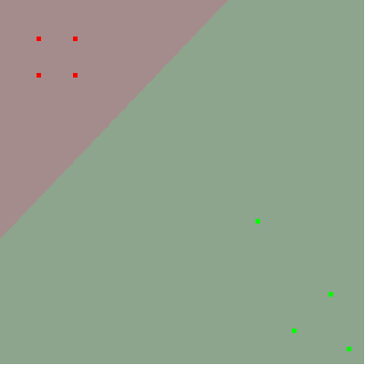
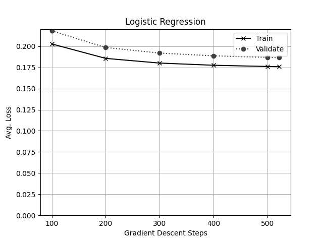

# Quin Thompson

# Assignment 3

_1 Point --
The visualization of the model learned on the UnitTest using 10 iterations of gradient descent, stepSize=1.0, convergence=0.005_

  

_1 Point –
Tune the hyperparameter ‘convergence’ by trying [ 0.01, 0.001, 0.0001, 0.00001 ] (with stepSize of 1.0). Produce a table showing:
`<convergence parameter>, <steps to convergence>, <validation set accuracy>`
for each setting of the convergence hyperparameter._

| convergence | steps | accuracy |
| ----------- | ----- | -------- |
| 0.01        | 8     | 0.841    |
| 0.001       | 57    | 0.867    |
| 0.0001      | 186   | 0.923    |
| 1e-05       | 522   | 0.927    |

  

_1 Point –
Describe in 2-3 sentences your interpretation of the output of this hyperparameter sweep. Include a justification for trying more parameters
or stopping there. If you do think you should try more values of the 'convergence' hyperparameter, what is the next one you would try?_

    The biggest takeaway from these results is that there was very little improvement in the accuracy of the model between the final two (0.0001 and 0.00001) convergence values. From this data I would conclude we don't need to try any additional values smaller than 0.0001 (the 3rd value) since there are diminishing returns on the amount of time spent fitting the model -- almost 3 times as many steps for only a 0.4% increase in accuracy--this small increase could be insignificant when generalizing this model to other data. If we were going to try another value, I would try between 0.001 and 0.0001 (probably 0.0005)--potentially the plateau in accuracy improvement is on the lower end of that spectrum.

_1 Point –
Produce a plot showing the training set loss and the validation set loss every 100 steps during the run
with the best convergence value you found in the parameter sweep and stepSize of 1.0. In no more than 100
words describe the difference between the training and validation loss. Which set does the model have better loss on? Why?_

The chart for `convergence = 0.00001`

As you can see by the chart above, both the Train and Validation Losses are plateauing, but the Training loss is less than the validation loss. This is because the model is fitting on the training data, minimizing training loss at every step, so it follows that the training loss would be less than the validation loss.
