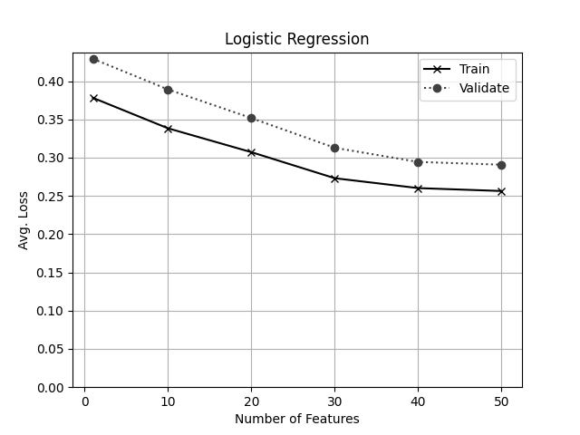

# Assignment 4

_Note that, for all of this, the HandCraftedFeatures are **disabled**_

_0.5 points -- A list of the top 10 bag of word features selected by filtering by frequency._

| words |
| ----- |
| to    |
| you   |
| I     |
| a     |
| the   |
| and   |
| is    |
| in    |
| i     |
| u     |

_0.5 points -- A list of the top 10 bag of word features selected by filtering by mutual information._

| words  |
| ------ |
| Call   |
| to     |
| call   |
| or     |
| FREE   |
| claim  |
| To     |
| mobile |
| &      |
| Txt    |

_Run logistic regression with the top 10 words by frequency. - 0.5 points -- (Short answer 1-3 sentences) Compare the accuracy of the model learned with 10 most frequent words
to the model that predicts the most common class. Increase the number of features selected by 5 until you outperform
the most common class model. What number do you need?_

The accuracy of the model learned with 10 most frequent words is about the same as that of the Most Common Model. It takes 25 most frequent words in order to outperform it. This makes sense since the most common words will likely tell us very little about whether the messages are spam.

_Run logistic regression with the top 10 words by mutual information.
0.5 points -- Produce a table showin the selected words and the weights learned for them_

| words  | weights  |
| ------ | -------- |
| Call   | 0.790714 |
| to     | 0.805763 |
| call   | 0.838575 |
| or     | 0.77981  |
| FREE   | 0.503679 |
| claim  | 0.446596 |
| To     | 0.487179 |
| mobile | 0.487407 |
| &      | 0.505    |
| Txt    | 0.462503 |

_- 0.5 points -- Create an if statement that partially matches the linear model, classifying some of the same messages
as spam (with no additional false positives). Use no more than 5 clauses in the if statement.
e.g. If has_word(X) and has_word(Y) then classify as spam_

```
def simpleModel(xRaw):
    return list(map(evalSampleSimple, xRaw))


def evalSampleSimple(x):
    if ("Call" in x and "FREE" in x):
        return 1
    if ("mobile" in x and "claim" in x):
        return 1
    if ("&" in x and "Call" in x):
        return 1
    return 0
```

This simple model actually performs better on the validation data than the linear model trained with the specified hyperparameters, and yields the following results:

        Confusion Matrix
        [trueNegatives, falsePositives]
        [falseNegatives, truePositives]
        [460, 0]
        [74, 13]
        Accuracy: 0.8647166361974405
        Precision: 1.0
        Recall: 0.14942528735632185
        FPR: 0.0
        FNR: 0.8505747126436781

Compare that to the Linear Model:

        Confusion Matrix
        [trueNegatives, falsePositives]
        [falseNegatives, truePositives]
        [459, 1]
        [80, 7]
        Accuracy: 0.8519195612431444
        Precision: 0.875
        Recall: 0.08045977011494253
        FPR: 0.002173913043478261
        FNR: 0.9195402298850575

_Perform a parameter sweep on the number of features to use as selected by frequency, using n = [ 1, 10, 20, 30, 40, 50 ]
0.5 points -- Produce a plot with the number of features used on the X axis, and the train and validation losses plotted on the y axis
0.5 points -- Make sure to label the chart correctly and completely! (in the future you will lose 0.5 points for any
chart that isn't properly labled)_



- Perform a parameter sweep on the number of features to use as selected by mutual information, using n = [ 1, 10, 20, 30, 40, 50 ]

* 0.5 points -- Produce a plot with the number of features used on the X axis, and the train and validation losses plotted on the y axis


- Provide short (1-3 sentence) answers to the following:

* 0.5 points -- Which feature selection seems better based on the information you have? Why?

  MI seems better based on the charts above, as well as the observed accuracy in earlier parts of the assignment. This also makes sense, since the most frequent words likely won't tell us much about spammy-ness of texts, since the vast majority of messages contain them.

* 0.5 points -- Would it make sense to try n = 100 with mutual information based feature selection? Why?

  Based on the chart above it seems that the ROI of increased features was diminishing as we approached 50, but it will increase the time to fit our model--so no.
