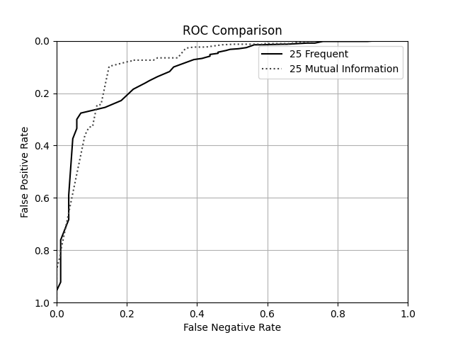
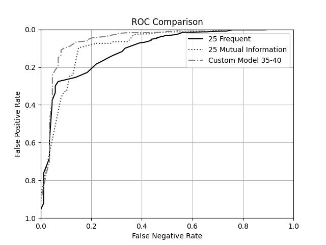

# Assignment 5

_1.0 point - Answer the following questions about the models produced by the framework code:_
_Which model is better at a 50% False positive rate?_

    By the produced ROC curve, the model that uses 25 Most Frequent Features is better.

_Which model is better at a 10% False positive rate?_

    The Mutual Information Model.

_Which model is better at a 40% False negative rate?_

    The Mutual Information Model.

_What classification threshold would you use with the numFrequentWords = 25 model to achieve a 10% False positive rate?_

    0.22

_1.0 points - In a few sentences, describe the strategy you used to find the better hyperparameters and the hyperperparameters you found to achieve the result?_

I first did an introductory sweep with the total number of features at 30, varying the number of mutual information words from 0 to 30 of the overall words (and frequent the rest) to see whether or not the optimal feature numbers would end up balanced between frequent and mutual information or skewed toward one or the other. In became clear it should be balanced, so I then did a hyperparameter with the total number of features at first 50, and then 75, focusing on the middle of both of these ranges. I then observed the produced curves for each of these (and in aggregate). This ultimately provided me with my final hyperparameters, shown below.

**Final Model:**

- numMutualInformationWords: 35
- numFrequentWords: 40

