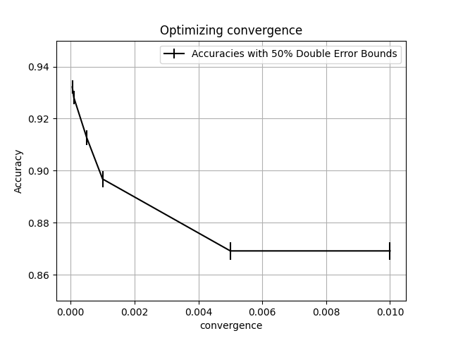
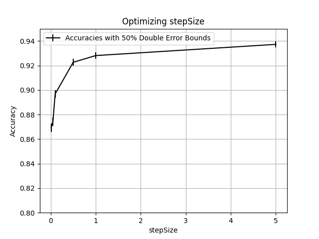
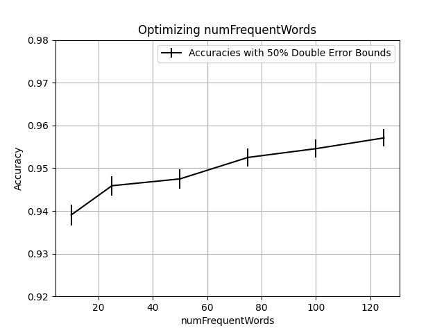
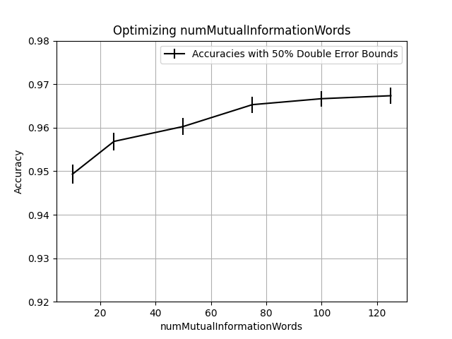
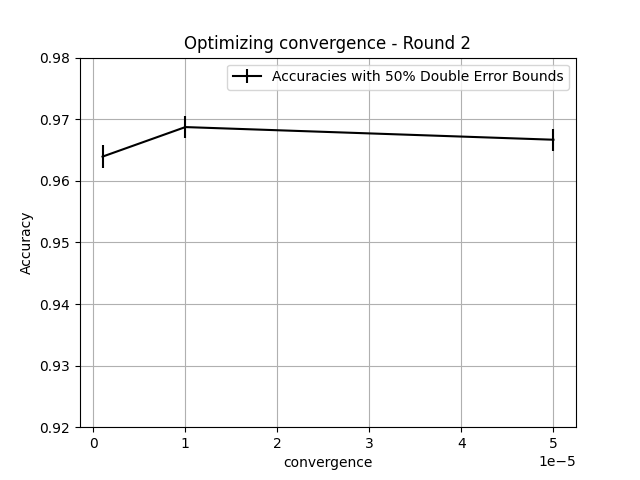
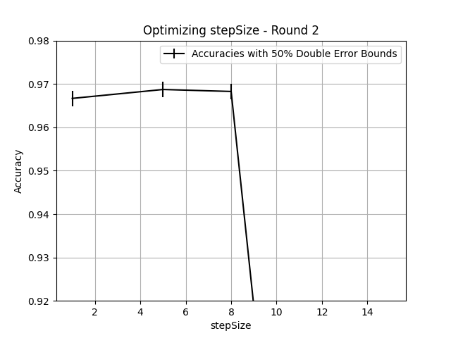
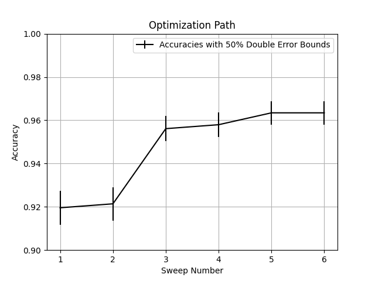
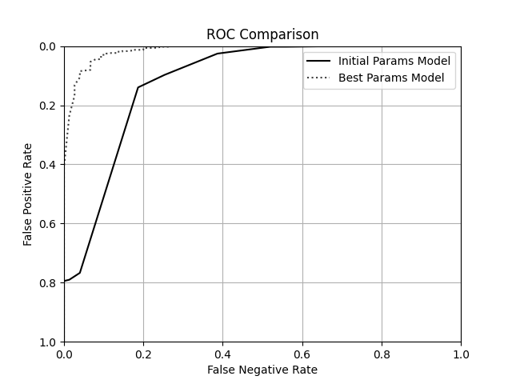

# Assignment 7

1. for each sweep try at least 6 settings, ranging somewhat uniformly between 'probably too high', to 'probably too low'

- e.g. for the feature selection parameters try varying by 20, e.g.: 20, 40, 60, ...
- for the gradient descent optimization parameters try several small integers and several much smaller, like 0.01, 0.001, ... 0.00001

2. for each sweep, produce:

- a plot showing the values of the parameter being optimized on X and (crossvalidation) accuracy with 50% (2-sided) error bars on Y
- a plot showing the values of the parameter being optimized on X and total runtime for the entire crossvalidation run on Y (in seconds)
- 2-3 sentences of interpretation. Were the parameters you tried too high or low? Would you tune further? Which way?

## First sweep of each parameter

### Convergence

| convergence | accuracy | lower bound | upper bound | runtime |
| ----------- | -------- | ----------- | ----------- | ------- |
| 0.01        | 0.869178 | 0.865764    | 0.872592    | 21.0677 |
| 0.005       | 0.869178 | 0.865764    | 0.872592    | 21.6501 |
| 0.001       | 0.896804 | 0.893724    | 0.899883    | 25.1067 |
| 0.0005      | 0.912785 | 0.909929    | 0.915642    | 27.823  |
| 0.0001      | 0.928082 | 0.925467    | 0.930698    | 39.6191 |
| 5e-05       | 0.932192 | 0.929647    | 0.934737    | 49.6368 |

    Tuned Hyperparameter Value: 0.0001

    As expected, accuracy increased as the convergence decreased. After lightly experimenting, decided to tune convergence first, as a way of enabling the tuning of the rest of the hyperparameters. With the default convergence, sweeps over mutual information, for example, yielded no discernable results. If I were to continue sweeping, I'll continue to decrease the convergence and see if we could get noticeable improvement for the runtime tradeoff.

### Step Size

| stepSize | accuracy | lower bound | upper bound | runtime |
| -------- | -------- | ----------- | ----------- | ------- |
| 5        | 0.937215 | 0.934759    | 0.93967     | 34.3776 |
| 1        | 0.928082 | 0.925467    | 0.930698    | 44.852  |
| 0.5      | 0.922603 | 0.919897    | 0.925308    | 51.2652 |
| 0.1      | 0.896804 | 0.893724    | 0.899883    | 68.8613 |
| 0.05     | 0.874201 | 0.870844    | 0.877558    | 76.5426 |
| 0.01     | 0.869178 | 0.865764    | 0.872592    | 77.4173 |

    Tuned Hyperparameter Value: 5

    I next tuned stepSize, but was surprised by the results -- the accuracy was proportional to the step size, but I would have expected the opposite. Some potential reasoning for this is that the steps are so small that we hit the convergence criteria earlier than we would for a larger step size. I'll continue tuning, and try larger step sizes.

### numFrequentWords

| numFrequentWords | accuracy | lower bound | upper bound | runtime |
| ---------------- | -------- | ----------- | ----------- | ------- |
| 10               | 0.939041 | 0.936619    | 0.941463    | 45.1375 |
| 25               | 0.94589  | 0.9436      | 0.948181    | 50.1063 |
| 50               | 0.947489 | 0.94523     | 0.949747    | 60.2341 |
| 75               | 0.952511 | 0.950358    | 0.954665    | 72.5623 |
| 100              | 0.954566 | 0.952458    | 0.956674    | 85.2399 |
| 125              | 0.957078 | 0.955026    | 0.95913     | 98.1008 |

    Tuned Hyperparameter Value: 100

    numFrequentWords seemed to converge nicely, and accuracy increased pretty significantly after tuning it. Will still try additional larger values to double check.

### numMutualInformationWords

| numMutualInformationWords | accuracy | lower bound | upper bound | runtime |
| ------------------------- | -------- | ----------- | ----------- | ------- |
| 10                        | 0.949315 | 0.947094    | 0.951536    | 83.7166 |
| 25                        | 0.956849 | 0.954792    | 0.958906    | 100.136 |
| 50                        | 0.960274 | 0.958297    | 0.962251    | 114.5   |
| 75                        | 0.965297 | 0.963444    | 0.96715     | 128.531 |
| 100                       | 0.966667 | 0.964849    | 0.968484    | 141.774 |
| 125                       | 0.967352 | 0.965552    | 0.969151    | 151.358 |

    Tuned Hyperparameter Value: 75

    Same as numFrequentWords--seemed to converge pretty well. Will still try additional larger values just to be safe.

1. after each sweep, update hyperparameter value (for future sweeps) in a way that tradesoff runtime vs accuracy, so that:

- the value you pick is tied with the highest accuracy value according to a 75% 1-sided bound (or beats all others according to this bound)
- the value you pick has the lowest runtime among these 'tied' values

## Further Tuning

### Convergence

| convergence | accuracy | lower bound | upper bound | runtime |
| ----------- | -------- | ----------- | ----------- | ------- |
| 5e-05       | 0.966667 | 0.964849    | 0.968484    | 152.064 |
| 1e-05       | 0.968721 | 0.966959    | 0.970484    | 410.077 |
| 1e-06       | 0.963927 | 0.962039    | 0.965815    | 1902.76 |

new convergence value: 1e-05

### stepSize

| stepSize | accuracy | lower bound | upper bound | runtime |
| -------- | -------- | ----------- | ----------- | ------- |
| 1        | 0.966667 | 0.964849    | 0.968484    | 628.724 |
| 5        | 0.968721 | 0.966959    | 0.970484    | 412.097 |
| 8        | 0.968265 | 0.96649     | 0.970039    | 366.642 |
| 10       | 0.869178 | 0.865764    | 0.872592    | 23.3975 |
| 15       | 0.869178 | 0.865764    | 0.872592    | 23.1997 |

New stepValue: 8

### numFrequentWord

| numFrequentWords | accuracy | lower bound | upper bound | runtime |
| ---------------- | -------- | ----------- | ----------- | ------- |
| 125              | 0.969178 | 0.967428    | 0.970928    | 498.236 |
| 150              | 0.967352 | 0.965552    | 0.969151    | 545.617 |
| 200              | 0.969635 | 0.967898    | 0.971372    | 648.858 |
| 250              | 0.968493 | 0.966725    | 0.970262    | 746.018 |

_no improvement_ -- converges

### numMutualInformationWords

| numMutualInformationWords | accuracy | lower bound | upper bound | runtime |
| ------------------------- | -------- | ----------- | ----------- | ------- |
| 125                       | 0.969863 | 0.968132    | 0.971594    | 539.414 |
| 150                       | 0.969406 | 0.967663    | 0.97115     | 604.11  |
| 200                       | 0.968265 | 0.96649     | 0.970039    | 694.178 |
| 250                       | 0.968721 | 0.966959    | 0.970484    | 800.424 |

_no improvement_ -- converges

## Optimization Sweeps Graph

4. after optimizing each hyperparameter, evaluate accuracy on the validation set:

- produce a model with all the best hyperparameters you've found so far (training on the full training set)
- produce a plot with validation accuracy and 50% (2-sided) error bars on Y - and the number of optimization sweeps done
  to that point on the X-axis (on point per sweep you do, increasing x value indicates further optimization.)

| optimizing                | value  | accuracy | lower bound | upper bound | runtime |
| ------------------------- | ------ | -------- | ----------- | ----------- | ------- |
| convergence               | 0.0001 | 0.919561 | 0.91177     | 0.927352    | 58.4241 |
| stepSize                  | 0.0001 | 0.921389 | 0.91368     | 0.929099    | 48.1962 |
| numFrequentWords          | 0.0001 | 0.956124 | 0.950257    | 0.961992    | 83.9098 |
| numMutualInformationWords | 0.0001 | 0.957952 | 0.952203    | 0.963702    | 110.32  |
| convergence               | 1e-05  | 0.963437 | 0.95806     | 0.968814    | 364.69  |
| stepSize                  | 1e-05  | 0.963437 | 0.95806     | 0.968814    | 319.955 |

## Final hyperparameters

| hyperparameter            | value   |
| ------------------------- | ------- |
| numMutualInformationWords | 75      |
| stepSize                  | 8       |
| convergence               | 0.00001 |
| numFrequentWords          | 100     |

## ROC

## Analysis

2-sided 50% bounds
| model | accuracy | lower bound | upper bound |
| ------- | -------- | ----------- | ----------- |
| initial | 0.869178 | 0.865764 | 0.872592 |
| final | 0.968265 | 0.96649 | 0.970039 |

As seen in the table above, there was a tremendous improvement in cross-validation accuracy as we tuned out hyperparameters. Based on the table above, we can say at 75% one-sided confidence (and probably much higher) that our tuned model is much better than the initial one. Similarly, looking at the ROC curve, we can see that our tuned model vastly outperforms the initial one in all cases, including low false positive rates (which we often discuss as an important metric for SMS Spam Filtering).
