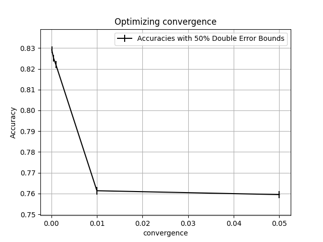
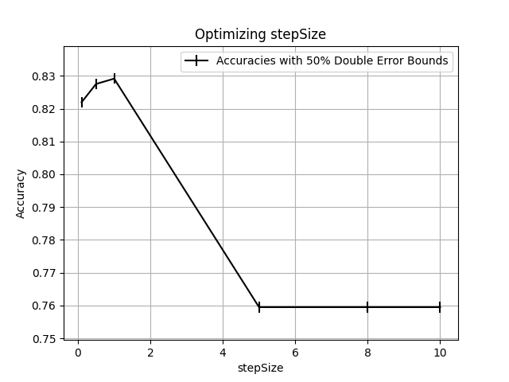

# Module 2 -- Assignment 1

## Convergence Tuning

stepSize: 1
50% 2 sided error bars

| convergence | accuracy | lower bound | upper bound | runtime |
| ----------- | -------- | ----------- | ----------- | ------- |
| 0.05        | 0.759476 | 0.757673    | 0.761278    | 4.28327 |
| 0.01        | 0.761337 | 0.75954     | 0.763134    | 10.1209 |
| 0.001       | 0.822052 | 0.82044     | 0.823665    | 40.202  |
| 0.0005      | 0.825142 | 0.82354     | 0.826743    | 62.518  |
| 0.0001      | 0.829142 | 0.827555    | 0.830729    | 161.093 |

## Step Size Tuning

convergence: 0.0001
50% 2 sided error bars

| stepSize | accuracy | lower bound | upper bound | runtime |
| -------- | -------- | ----------- | ----------- | ------- |
| 10       | 0.759476 | 0.757673    | 0.761278    | 3.58102 |
| 8        | 0.759476 | 0.757673    | 0.761278    | 3.76564 |
| 5        | 0.759476 | 0.757673    | 0.761278    | 4.08701 |
| 1        | 0.829142 | 0.827555    | 0.830729    | 181.786 |
| 0.5      | 0.827518 | 0.825925    | 0.829111    | 228.149 |
| 0.1      | 0.821934 | 0.82032     | 0.823547    | 377.726 |

## Analysis

The best hyperparameter settings:

- convergence: `0.0001`
  - Accuracy: 0.829142 (0.827555 - 0.830729)
- stepSize: `1.0`
  - Accuracy: 0.829142 (0.827555 - 0.830729)

Most Common Class model validate set accuracy: 0.7633 (50% 0.7582 - 0.7684)

Best Accuracy found by tuning: 0.829142 (0.827555 - 0.830729)

Our expected accuracy is 0.065842 better than the accuracy of the Most Common Model. Additionally, looking at the error bars above we can say at a 75% one-sided confidence interval that our model is better than the most common class model.
