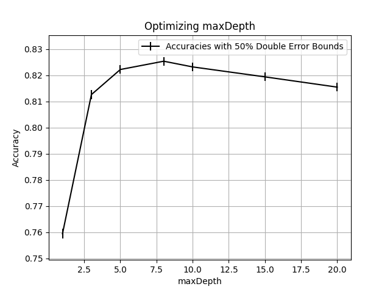
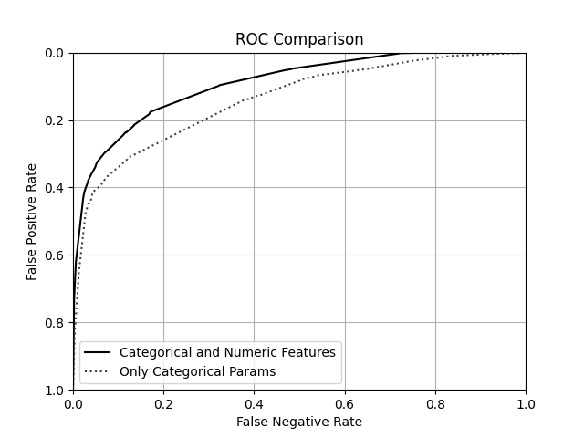

# Assignment 2

## Parameter Sweeps

### Numeric and Categorical Features

| maxDepth | accuracy | lower bound | upper bound | runtime |
| -------- | -------- | ----------- | ----------- | ------- |
| 1        | 0.759476 | 0.757673    | 0.761278    | 186.107 |
| 3        | 0.846053 | 0.844532    | 0.847575    | 318.294 |
| 5        | 0.844746 | 0.843219    | 0.846273    | 395.475 |
| 8        | 0.854212 | 0.852724    | 0.8557      | 434.332 |
| 10       | 0.851044 | 0.849542    | 0.852545    | 445.942 |
| 15       | 0.84435  | 0.842822    | 0.845879    | 459.84  |
| 20       | 0.835875 | 0.834313    | 0.837436    | 465.214 |

### Only Categorical Features

| maxDepth | accuracy | lower bound | upper bound | runtime |
| -------- | -------- | ----------- | ----------- | ------- |
| 1        | 0.759476 | 0.757673    | 0.761278    | 130.454 |
| 3        | 0.812626 | 0.810981    | 0.814272    | 211.264 |
| 5        | 0.822211 | 0.820599    | 0.823823    | 254.303 |
| 8        | 0.825379 | 0.823778    | 0.82698     | 289.562 |
| 10       | 0.823201 | 0.821592    | 0.82481     | 303.104 |
| 15       | 0.819399 | 0.817777    | 0.821021    | 324.165 |
| 20       | 0.815478 | 0.813842    | 0.817113    | 337.694 |

### Only Numeric Features

| maxDepth | accuracy | lower bound | upper bound | runtime |
| -------- | -------- | ----------- | ----------- | ------- |
| 1        | 0.80118  | 0.799497    | 0.802863    | 60.946  |
| 3        | 0.801339 | 0.799656    | 0.803021    | 133.152 |
| 5        | 0.820032 | 0.818413    | 0.821652    | 159.428 |
| 8        | 0.829775 | 0.828191    | 0.83136     | 173.152 |
| 10       | 0.829855 | 0.82827     | 0.831439    | 176.701 |
| 15       | 0.81825  | 0.816624    | 0.819876    | 178.97  |
| 20       | 0.804626 | 0.802954    | 0.806298    | 179.494 |

## ROC

## Analysis

At 75% one-sided accuracy, we can make several conclusions from the data above. First, featurizing using both numeric and categorical features is more accurate than only categorical, or only numeric, as the lower bound of the best accuracy in the param sweep with both feature types (0.853) is larger than the upper bound of the best using only one type (0.827). Next, we can conclude that a maxDepth of 8 is the optimal hyperparameter for this model. (again by looking at the lower/upper accuracy bounds). Finally, the model that uses both param types dominates the model that only uses categorical in the above ROC curve, further indicating the necessity of numerical features.
