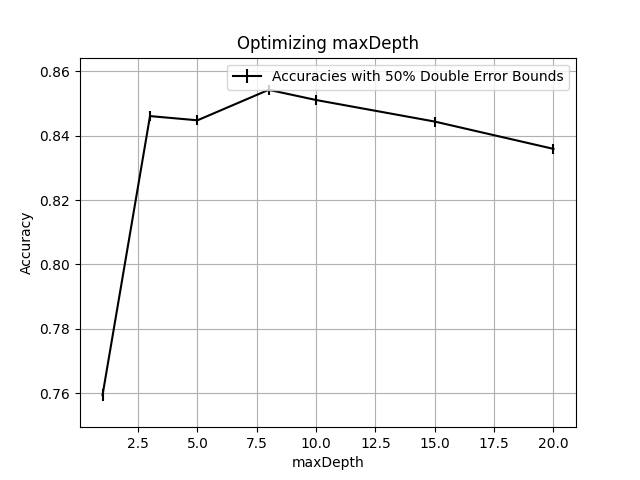
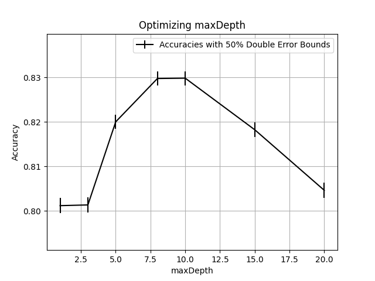

# Assignment 2

## Parameter Sweeps

### Numeric and Categorical Features

| maxDepth | accuracy | lower bound | upper bound | runtime |
| -------- | -------- | ----------- | ----------- | ------- |
| 1        | 0.759476 | 0.757673    | 0.761278    | 186.107 |
| 3        | 0.846053 | 0.844532    | 0.847575    | 318.294 |
| 5        | 0.844746 | 0.843219    | 0.846273    | 395.475 |
| 8        | 0.854212 | 0.852724    | 0.8557      | 434.332 |
| 10       | 0.851044 | 0.849542    | 0.852545    | 445.942 |
| 15       | 0.84435  | 0.842822    | 0.845879    | 459.84  |
| 20       | 0.835875 | 0.834313    | 0.837436    | 465.214 |

### Only Categorical Features

### Only Numeric Features

| maxDepth | accuracy | lower bound | upper bound | runtime |
| -------- | -------- | ----------- | ----------- | ------- |
| 1        | 0.80118  | 0.799497    | 0.802863    | 60.946  |
| 3        | 0.801339 | 0.799656    | 0.803021    | 133.152 |
| 5        | 0.820032 | 0.818413    | 0.821652    | 159.428 |
| 8        | 0.829775 | 0.828191    | 0.83136     | 173.152 |
| 10       | 0.829855 | 0.82827     | 0.831439    | 176.701 |
| 15       | 0.81825  | 0.816624    | 0.819876    | 178.97  |
| 20       | 0.804626 | 0.802954    | 0.806298    | 179.494 |

