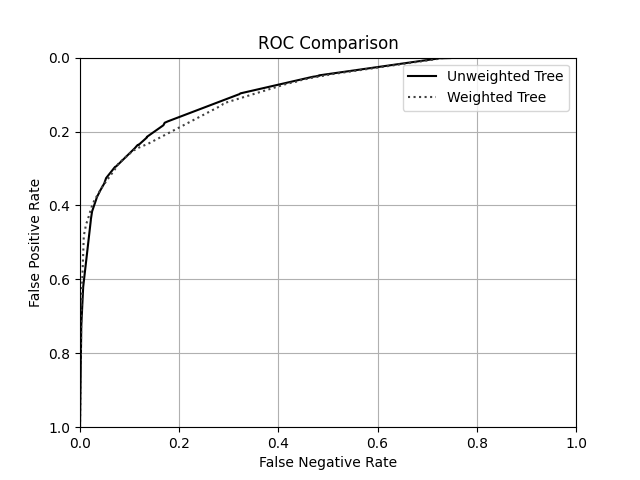

# Assignment 3

## ROC Curve

## Analysis

By giving training data with age less than 45 (let's call this T_young) a weight of 10 (as opposed to 1), during the fitting process, mislabeled T_young values at decision tree leaves will have a proportionally large impact on entropy. This will cause the greedy loss minimization algorithm to avoid any feature splits that mislabel this data. We might want to use this weighting system if we are focusing on the model precision for our users under 45, or if we have reason to believe that our labels for people under 45 is of higher quality (more accurate labels).
