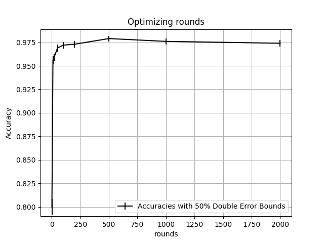

# Assignment 4

## Hyperparameter Sweep

| rounds | accuracy | lower bound | upper bound | runtime  |
| ------ | -------- | ----------- | ----------- | -------- |
| 1      | 0.8      | 0.791525    | 0.808475    | 0.435331 |
| 10     | 0.956    | 0.951655    | 0.960345    | 3.92025  |
| 20     | 0.959    | 0.954799    | 0.963201    | 7.38306  |
| 50     | 0.969    | 0.965328    | 0.972672    | 16.3566  |
| 100    | 0.972    | 0.968505    | 0.975495    | 30.8486  |
| 200    | 0.973    | 0.969566    | 0.976434    | 59.4627  |
| 500    | 0.979    | 0.975962    | 0.982038    | 142.91   |
| 1000   | 0.976    | 0.972757    | 0.979243    | 273.635  |
| 2000   | 0.974    | 0.970628    | 0.977372    | 528.763  |

## Visualization

Best value before diminishing returns: 50 (upper bound of 50 > lower bound 100).

**Visualization of most accurate model (50 rounds) on synthetic concept:**

