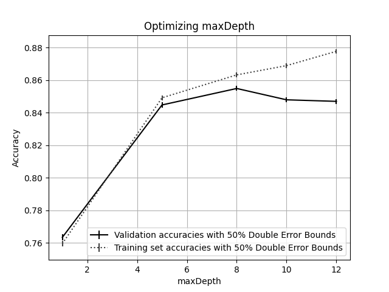
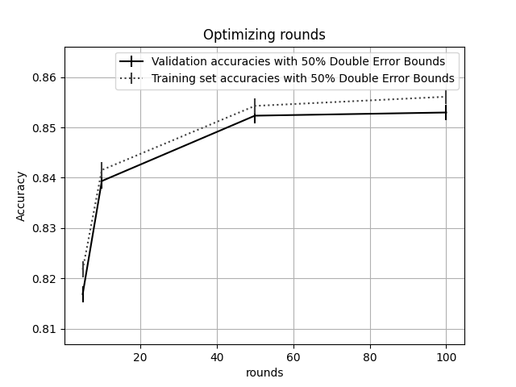

# Assignment 5

## Decision Trees -- Max Depth

### Weighted

weights = `1` for all `x`

| maxDepth | accuracy | lower bound | upper bound | runtime |
| -------- | -------- | ----------- | ----------- | ------- |
| 1        | 0.763308 | 0.761516    | 0.7651      | 1360.87 |
| 5        | 0.84474  | 0.843213    | 0.846267    | 2844.62 |
| 8        | 0.85488  | 0.853394    | 0.856365    | 3156.67 |
| 10       | 0.847909 | 0.846395    | 0.849423    | 3229.52 |
| 12       | 0.846958 | 0.84544     | 0.848476    | 3281.8  |

### Normal

| maxDepth | accuracy | lower bound | upper bound | runtime |
| -------- | -------- | ----------- | ----------- | ------- |
| 1        | 0.763308 | 0.761516    | 0.7651      | 432.149 |
| 5        | 0.84474  | 0.843213    | 0.846267    | 806.261 |
| 8        | 0.85488  | 0.853394    | 0.856365    | 887.701 |
| 10       | 0.847909 | 0.846395    | 0.849423    | 910.152 |
| 12       | 0.846958 | 0.84544     | 0.848476    | 926.142 |

## AdaBoost

| rounds | accuracy | lower bound | upper bound | runtime |
| ------ | -------- | ----------- | ----------- | ------- |
| 5      | 0.816857 | 0.815226    | 0.818488    | 20.3457 |
| 10     | 0.839354 | 0.837805    | 0.840902    | 40.1198 |
| 50     | 0.852345 | 0.850849    | 0.853841    | 185.55  |
| 100    | 0.852978 | 0.851485    | 0.854472    | 321.768 |

## NEW RUNS

TODO STILL NEED TO DO LOG REG

### WEIGHTED TREE

| rounds | accuracy | lower bound | upper bound | runtime |
| ------ | -------- | ----------- | ----------- | ------- |
| 5      | 0.816857 | 0.815226    | 0.818488    | 19.4456 |
| 10     | 0.839354 | 0.837805    | 0.840902    | 39.1113 |
| 20     | 0.845691 | 0.844168    | 0.847214    | 77.9304 |
| 50     | 0.852345 | 0.850849    | 0.853841    | 192.765 |
| 100    | 0.852978 | 0.851485    | 0.854472    | 362.965 |
| 200    | 0.850444 | 0.84894     | 0.851947    | 612.36  |
