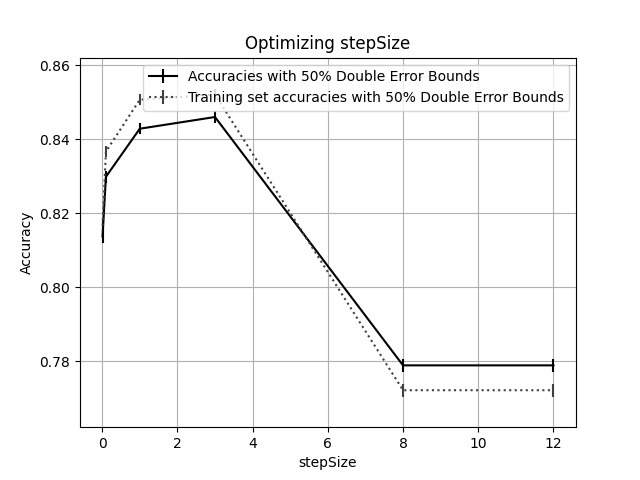

# Assignment 5

## Decision Trees -- Max Depth

### Weighted

weights = `1` for all `x`

| maxDepth | accuracy | lower bound | upper bound | runtime |
| -------- | -------- | ----------- | ----------- | ------- |
| 1        | 0.763308 | 0.761516    | 0.7651      | 1360.87 |
| 5        | 0.84474  | 0.843213    | 0.846267    | 2844.62 |
| 8        | 0.85488  | 0.853394    | 0.856365    | 3156.67 |
| 10       | 0.847909 | 0.846395    | 0.849423    | 3229.52 |
| 12       | 0.846958 | 0.84544     | 0.848476    | 3281.8  |

As seen by the divergence between the train and validation set accuracy in the graph above, there is certainly overfitting occurring when maxDepth is increased past 8. Train set accuracy continues to increase, whereas validation set accuracy decreasing significantly. This indicates an inability to generalize.

### Normal

| maxDepth | accuracy | lower bound | upper bound | runtime |
| -------- | -------- | ----------- | ----------- | ------- |
| 1        | 0.763308 | 0.761516    | 0.7651      | 432.149 |
| 5        | 0.84474  | 0.843213    | 0.846267    | 806.261 |
| 8        | 0.85488  | 0.853394    | 0.856365    | 887.701 |
| 10       | 0.847909 | 0.846395    | 0.849423    | 910.152 |
| 12       | 0.846958 | 0.84544     | 0.848476    | 926.142 |

Exact same analysis as the weighted tree--just ran both of them as a sanity check for my weighted decision tree algorithm. Overfitting here as well--divergence of train set and validation set accuracy.

## AdaBoost - Rounds

`maxDepth = 1` for underlying trees.

| rounds | accuracy | lower bound | upper bound | runtime |
| ------ | -------- | ----------- | ----------- | ------- |
| 5      | 0.816857 | 0.815226    | 0.818488    | 20.3457 |
| 10     | 0.839354 | 0.837805    | 0.840902    | 40.1198 |
| 50     | 0.852345 | 0.850849    | 0.853841    | 185.55  |
| 100    | 0.852978 | 0.851485    | 0.854472    | 321.768 |

The sweep over rounds for AdaBoost isn't as conclusive in regards to over/underfitting as the sweeps for decision trees were. This makes sense as AdaBoost with maxDepth set to 1 for the underlying decision tree is pretty resistant to overfitting. Potentially could sweep further.

## Logistic Regression -- stepSize

`convergence = 0.0001`

| stepSize | accuracy | lower bound | upper bound | runtime |
| -------- | -------- | ----------- | ----------- | ------- |
| 0.01     | 0.813688 | 0.812046    | 0.81533     | 1070.1  |
| 0.1      | 0.829848 | 0.828263    | 0.831432    | 490.446 |
| 1        | 0.842839 | 0.841304    | 0.844374    | 242.321 |
| 3        | 0.846008 | 0.844486    | 0.84753     | 145.417 |
| 8        | 0.778834 | 0.777084    | 0.780584    | 4.54278 |
| 12       | 0.778834 | 0.777084    | 0.780584    | 4.62754 |

As we discussed in class, logistic regression is a high-bias algorithm, and the graph above reflects that--there is no overfitting (often associated with algorithms with high variance) and potential underfitting (often associated with algorithms with high bias).

## Analysis

In the above tables and graphs, we see much expected behavior amongst the analyzed algorithms. The decision tree -- a low bias, high variance algorithm -- ultimately overfit the data after maxDepth hit a certain threshold (8). AdaBoost, paired with decision trees with a maxDepth of 1 (which reduces it's ability to overfit), generally increased with additional rounds--AdaBoost is designed to deal with the variance problems of powerful algorithms, so it makes sense that it did not overfit even as the number of rounds was increased. Logistic Regression did not overfit, but it also could not produce _quite_ as accurate of a model as the other model types either -- being a high bias model, logistic regression was unable to fully represent the concept at hand.
