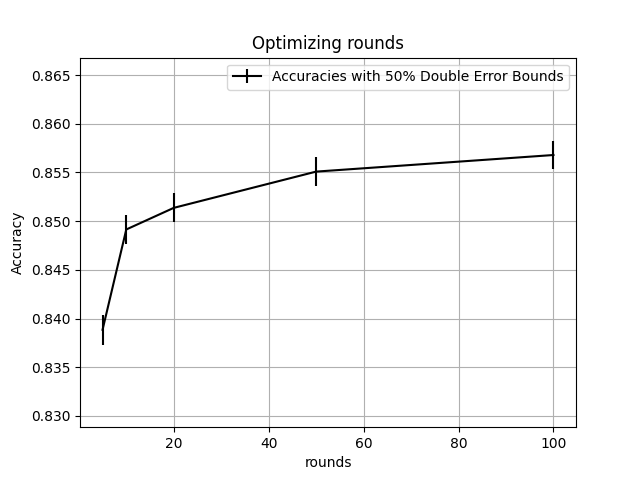
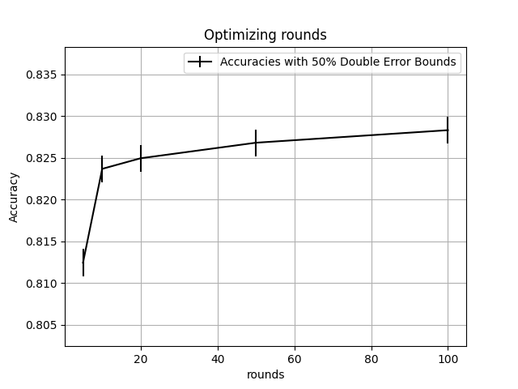

# Assignment 6 -- Tuning

## Initial Rounds Sweep

First, I did a hyperparameter sweep over the number of rounds for ADABoost to use, with `maxDepth = 2`.

| rounds | accuracy | lower bound | upper bound | runtime |
| ------ | -------- | ----------- | ----------- | ------- |
| 5      | 0.838845 | 0.837295    | 0.840395    | 51.8927 |
| 10     | 0.849143 | 0.847633    | 0.850652    | 96.5881 |
| 20     | 0.85136  | 0.849861    | 0.85286     | 174.495 |
| 50     | 0.855083 | 0.853599    | 0.856568    | 404.734 |
| 100    | 0.856786 | 0.855309    | 0.858263    | 774.219 |
| 200    | 0.857697 | 0.856224    | 0.85917     | 1426.38 |
| 1000   | 0.85948  | 0.858014    | 0.860945    | 5973.96 |
| 2000   | 0.864193 | 0.862748    | 0.865637    | 11860.1 |

The accuracy does seem to continue to improve at very high values of rounds, but considering the time tradeoff and the accuracy bounds, 50 seems like the best hyperparameter from this sweep moving forward (lower bound is greater than the upper bound at 20 rounds, upper bound is greater than the lower bounds at both 100 and 200 rounds).

## Exploring the use of numeric features

### Exploring Normalization

Even though numeric feature normalization is specifically useful for logistic regression, I first quickly investigated whether normalization would make a difference in the boosted tree fitting process (it doesn't, as expected.)

Here is the table and chart with `maxDepth = 2`
| rounds | accuracy | lower bound | upper bound | runtime |
| ------ | -------- | ----------- | ----------- | ------- |
| 5 | 0.838845 | 0.837295 | 0.840395 | 42.5733 |
| 10 | 0.849143 | 0.847633 | 0.850652 | 83.1104 |
| 20 | 0.85136 | 0.849861 | 0.85286 | 161.211 |
| 50 | 0.855083 | 0.853599 | 0.856568 | 377.536 |
| 100 | 0.856786 | 0.855309 | 0.858263 | 692.538 |

The accuracies in the table above are the same as those in the previous sweep. i.e. normalization had no effect.

### Use of numeric features

Next, I examined the utility of numeric features all up.

`maxDepth = 2`
`useNumericFeatures=False`

| rounds | accuracy | lower bound | upper bound | runtime |
| ------ | -------- | ----------- | ----------- | ------- |
| 5      | 0.812428 | 0.810782    | 0.814074    | 37.4716 |
| 10     | 0.823676 | 0.822069    | 0.825283    | 73.1835 |
| 20     | 0.824944 | 0.823341    | 0.826546    | 143.017 |
| 50     | 0.826805 | 0.825209    | 0.828401    | 329.919 |
| 100    | 0.82831  | 0.82672     | 0.8299      | 588.824 |

As show by the table/chart above, numeric features improve accuracy in all examined values of rounds. I will be using them moving forward.

## Optimizing maxDepth

`rounds = 50`

| maxDepth | accuracy | lower bound | upper bound | runtime |
| -------- | -------- | ----------- | ----------- | ------- |
| 1        | 0.852034 | 0.850537    | 0.853531    | 198.981 |
| 2        | 0.855083 | 0.853599    | 0.856568    | 402.624 |
| 3        | 0.85841  | 0.85694     | 0.85988     | 601.846 |
| 5        | 0.860509 | 0.859048    | 0.86197     | 904.82  |
| 7        | 0.859836 | 0.858372    | 0.8613      | 1153.54 |
| 9        | 0.85944  | 0.857974    | 0.860905    | 1430.44 |

## Additional Sweeps of rounds

`maxDepth = 5`
| rounds | accuracy | lower bound | upper bound | runtime |
|----------|------------|---------------|---------------|-----------|
| 50 | 0.860509 | 0.859048 | 0.86197 | 917.781 |
| 100 | 0.861777 | 0.860321 | 0.863232 | 1846.25 |
| 150 | 0.864945 | 0.863504 | 0.866386 | 2734.42 |
| 200 | 0.865777 | 0.864339 | 0.867214 | 3619.67 |

## ROC Curves

## Best parameter settings

- AdaBoost:
  - Rounds: 150
  - maxDepth: 5
  - Accuracy:
    - 0.864945
    - Upper bound: 0.866386
    - Lower Bound: 0.863504
- Decision Tree
  - maxDepth: 8
  - Accuracy
    - 0.85488
    - Upper Bound: 0.856365
    - Lower Bound: 0.853394
- Logistic Regression
  - convergence: 0.0001
  - stepSize: 3.0
  - Accuracy
    - 0.846008
    - Upper Bound: 0.84753
    - Lower Bound: 0.844486
