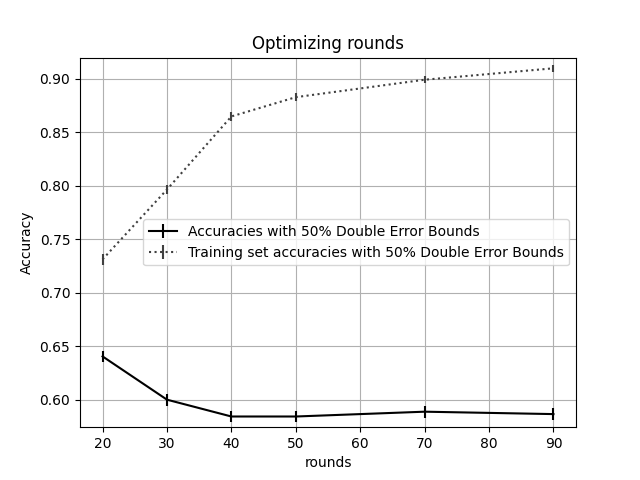
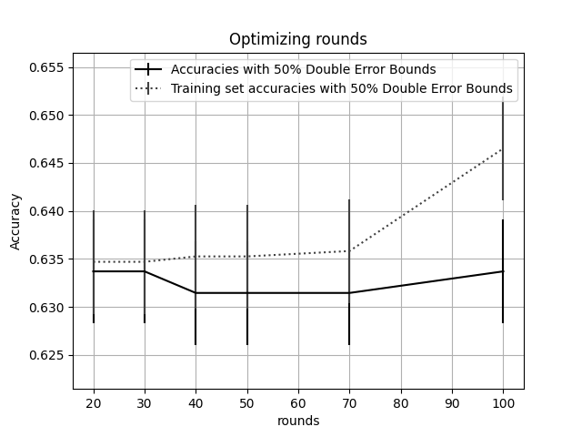
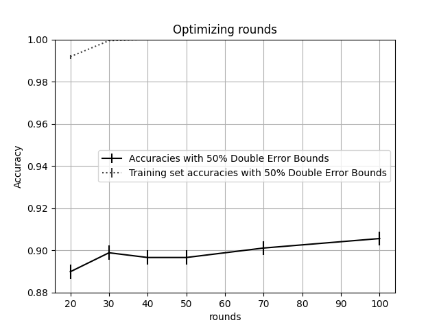
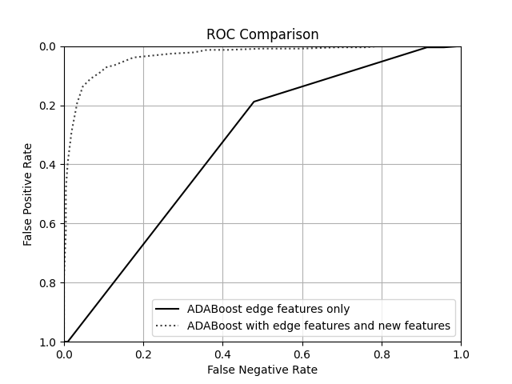

# Assignment 1

## Tuning Rounds on AdaBoost (without new features)

`maxDepth = 10`

| rounds | accuracy | lower bound | upper bound | runtime |
| ------ | -------- | ----------- | ----------- | ------- |
| 20     | 0.640449 | 0.635058    | 0.645841    | 25.7918 |
| 30     | 0.6      | 0.594496    | 0.605504    | 29.7191 |
| 40     | 0.58427  | 0.578732    | 0.589807    | 32.8805 |
| 50     | 0.58427  | 0.578732    | 0.589807    | 36.503  |
| 70     | 0.588764 | 0.583236    | 0.594293    | 43.1023 |
| 90     | 0.586517 | 0.580984    | 0.59205     | 48.761  |

`maxDepth = 5`

| rounds | accuracy | lower bound | upper bound | runtime |
| ------ | -------- | ----------- | ----------- | ------- |
| 20     | 0.633708 | 0.628295    | 0.639121    | 20.0071 |
| 30     | 0.633708 | 0.628295    | 0.639121    | 21.7878 |
| 40     | 0.631461 | 0.626041    | 0.636881    | 23.4325 |
| 50     | 0.631461 | 0.626041    | 0.636881    | 24.9696 |
| 70     | 0.631461 | 0.626041    | 0.636881    | 28.4864 |
| 100    | 0.633708 | 0.628295    | 0.639121    | 33.5207 |

## Tuning Rounds on AdaBoost (with new features)

`maxDepth = 5`

| rounds | accuracy | lower bound | upper bound | runtime |
| ------ | -------- | ----------- | ----------- | ------- |
| 20     | 0.889888 | 0.886371    | 0.893405    | 96.8204 |
| 30     | 0.898876 | 0.895489    | 0.902264    | 117.744 |
| 40     | 0.896629 | 0.893209    | 0.90005     | 137.232 |
| 50     | 0.896629 | 0.893209    | 0.90005     | 155.605 |
| 70     | 0.901124 | 0.89777     | 0.904477    | 188.172 |
| 100    | 0.905618 | 0.902333    | 0.908903    | 232.042 |

## ROC

## Analysis

Looking at the original chart of rounds tuning with maxDepth = 10, we can see some overfitting due to the high-variance nature of the underlying Weighted Decision Tree with a large maxDepth. Because of this, I decided to try a lower maxDepth (5) which seemed to suffer from overfitting less.

Looking at the hyperparameter tuning charts above, we can see that, at (at least) 75% one-sided confidence, that, while holding all other hyperparameters constant, including our additional handcrafted features improves the accuracy of the trained ADABoost algorithm. We can also see this reflected in the ROC Curve above--the model trained with the additional handcrafted features completely dominates that trained with only the edge features. My best produced model had hyperparameters as follows:

- `maxDepth = 5`
- `Rounds = 100`
- `includeEdgeFeatures = True`
- `includeSubdividedFeatures = True`

And, the resulting accuracy of this model on the validation data was 0.905618, with a 50% confidence upper bound of 0.908903, and a 50% confidence lower bound of 0.902333.
