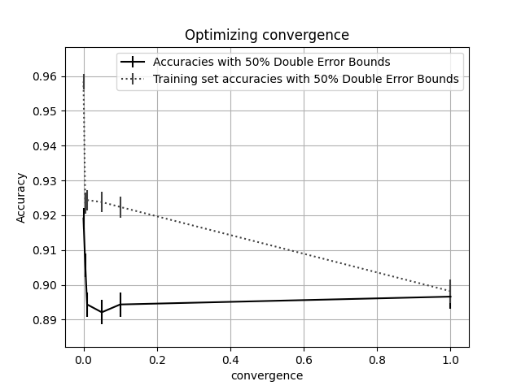
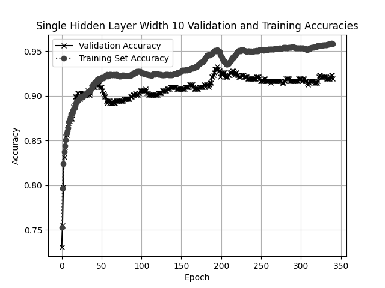
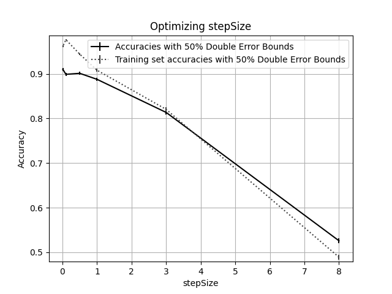
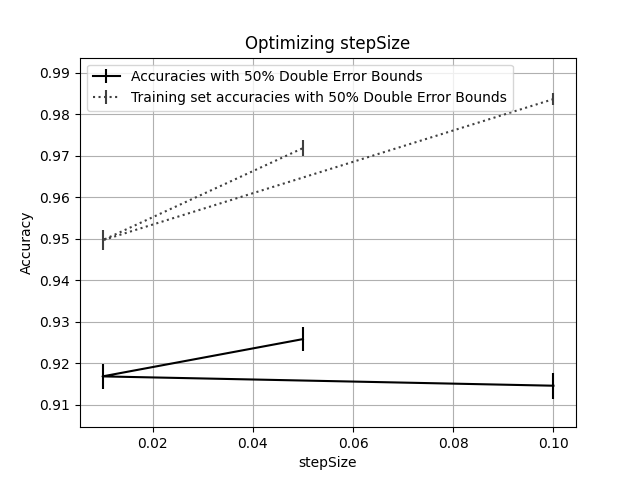
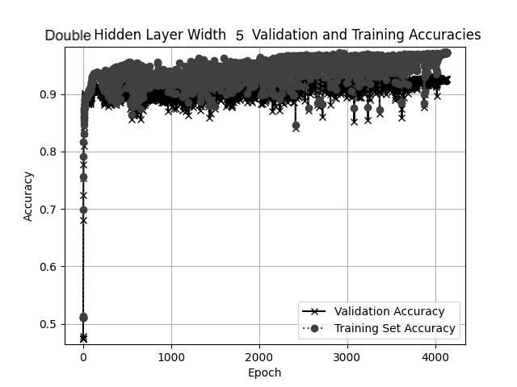

# Assignment 2 -- Neural Networks

## Hyperparameter Tuning

### Single Layer Network

**Tuning Convergence**

`stepSize=0.1`

`10 Neurons in Middle Layer`

| convergence | accuracy | lower bound | upper bound | runtime |
| ----------- | -------- | ----------- | ----------- | ------- |
| 1           | 0.896629 | 0.893209    | 0.90005     | 53.7957 |
| 0.1         | 0.894382 | 0.890929    | 0.897835    | 138.869 |
| 0.05        | 0.892135 | 0.888649    | 0.89562     | 140.002 |
| 0.01        | 0.894382 | 0.890929    | 0.897835    | 147.494 |
| 0.005       | 0.905618 | 0.902333    | 0.908903    | 271.21  |
| 0.0001      | 0.919101 | 0.916037    | 0.922165    | 645.184 |

After tinkering a little with stepSize on the original hidden layer configuration (only 2 nodes in a single layer), I decided to go ahead and try 10 nodes with an acceptable value of stepSize (0.1) and do a sweep over convergence. As seen above my best resulting hyperparameters from this sweep was a convergence of 0.0001. This gave me an accuracy of 0.9191, which easily exceeds the criteria laid out in the assignment prompt (0.85). This fit converged in 341 epochs.

**Accuracy Plot**

### Visualization of Single Layer Network

**Neuron 0**

**Neuron 1**

**Neuron 2**

**Neuron 3**

**Neuron 4**

**Neuron 5**

**Neuron 6**

**Neuron 7**

**Neuron 8**

**Neuron 9**

### Double Layer Network

**Tuning StepSize**

`convergence = 0.0001`

`10 Neurons in Both Layers`

`maxEpochs = 1000`

| stepSize | accuracy | lower bound | upper bound | runtime |
| -------- | -------- | ----------- | ----------- | ------- |
| 8        | 0.525843 | 0.520232    | 0.531453    | 87.0139 |
| 3        | 0.813483 | 0.809107    | 0.81786     | 3334.93 |
| 1        | 0.88764  | 0.884092    | 0.891189    | 3340.79 |
| 0.5      | 0.901124 | 0.89777     | 0.904477    | 3258.73 |
| 0.1      | 0.898876 | 0.895489    | 0.902264    | 3284.91 |
| 0.01     | 0.910112 | 0.906899    | 0.913326    | 3304.52 |

For double layer, I went ahead and used my best value of convergence from my single layer hyperparameter sweep and applied it to two layers of 10 nodes. Unfortunately, as seen in the chart above (look at runtimes) I had my maxEpochs value too low to reach convergence. I increased my maxEpochs value to 50000, decreased the layers to 5 nodes each, and tried again (with the best values of stepSize).

`convergence = 0.0001`

`5 Neurons in Both Layers`

`maxEpochs = 50000`

| stepSize | accuracy | lower bound | upper bound | runtime |
| -------- | -------- | ----------- | ----------- | ------- |
| 0.1      | 0.914607 | 0.911467    | 0.917747    | 7654.76 |
| 0.01     | 0.916854 | 0.913752    | 0.919956    | 906.938 |
| 0.05     | 0.925843 | 0.922899    | 0.928787    | 5199.8  |

(Sorry for the weird plot here) Looking at the results above, the best stepSize is 0.05, producing an accuracy of 0.9258. As this exceeds the specifications in the problem statement, I will be using these hyperparameters (stepSize = 0.05, convergence = 0.0001, and 2 hidden layers with width 5) moving forward.

**Accuracy Plot**

